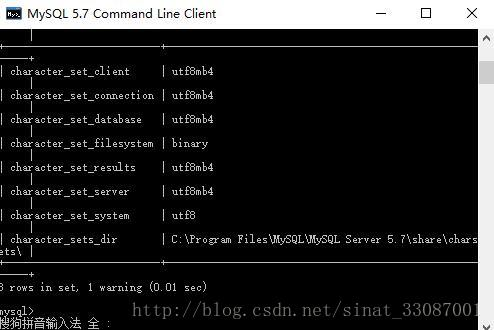
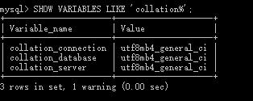

# Mysql设置编码集为utf8mb4

## 参考引用

## 运行环境

* 系统：Ubuntu-16.03  64Bit
* 数据库：Mysql5.7

## 配置方法

**在mysql配置中修改如下参数：**

```conf
[client]
default-character-set = utf8mb4

[mysql]
default-character-set = utf8mb4

[mysqld]
character-set-client-handshake = FALSE
character-set-server = utf8mb4
collation-server = utf8mb4_unicode_ci
init_connect='SET NAMES utf8mb4'
```

修改后，重启mysql服务[`service mysql restart`]，通过以下语句查看结果：

```sql
> SHOW VARIABLES LIKE 'character_set%'; 数据库字符集-图01
> SHOW VARIABLES LIKE 'collation%';数据表字符集图-02
```

**结果如下图：**

_数据库字符集-01_

_数据库字符集-02_
